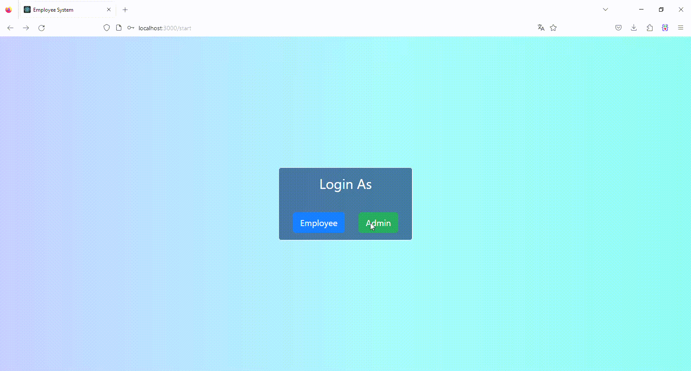

# Employee Management System

Full stack web app for managing employees consisting of a dashboard with functions to create, read, update and delete information. The app has an authentication system to handle employees and admins login. This template poject has basic functions and components a management system has, but it can be improved according to needs.

## Main technologies

* __Frontend__: React.js and Bootstrap
* __Backend__: Node.js & Express.js
* __Database__: MySQL

## Relevant libraries as dependencies

* __axios__: Useful to comunicate frontend and backend through HTTP requests.
* __recharts__: Library to setup charts and data visualizations in React.js
* __JWT__ (jsonwebtoken): Useful to handle authentication.
* __bcrypt__: For password encripting.
* __mysql2__: Driver for interactig with MySQL DB.
* __multer__: Helps to handle files uploading.
* __express-validator__: Handy to make server-side data validations.

## Demo

### Employee profile sample

